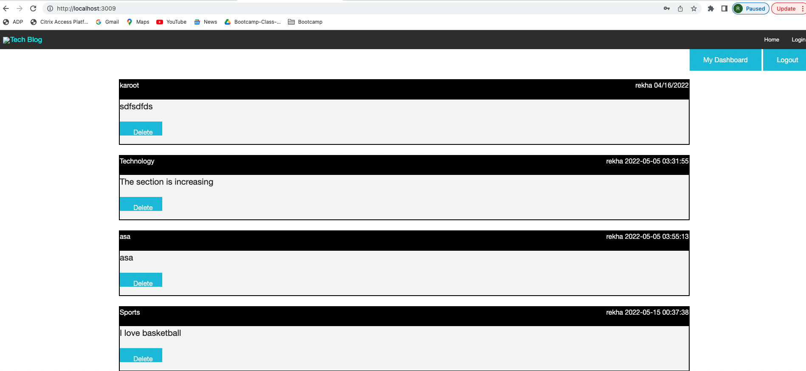

## Description

This application helps the users to sign in with their credentials and create, edit or delete blog posts. The user can also add comments to the blog posts.

## Screenshot

## GitHub Repo

Repo: https://github.com/RekhaLeelara/MVC_TechBlog

## Deployed Application Link

https://rekhaleelara.github.io/MVC_TechBlog/

## Usage

1. Go to Application link "https://rekhaleelara.github.io/MVC_TechBlog/"
2. Click on Login and Sign up if you're a new user
3. Once logged in, go to the dashboard
4. Add Posts
5. Click on the header of the post and edit/delete posts
6. You can even enter comments for the posts
7. Logout of the application once done.

## Support

N/A

## Roadmap

Add graphics to make this presentable and add more contents/skills.

## License

N/A

## Project Status

Baseline project completed. Additional enhancements can be done based on the user feedback.
